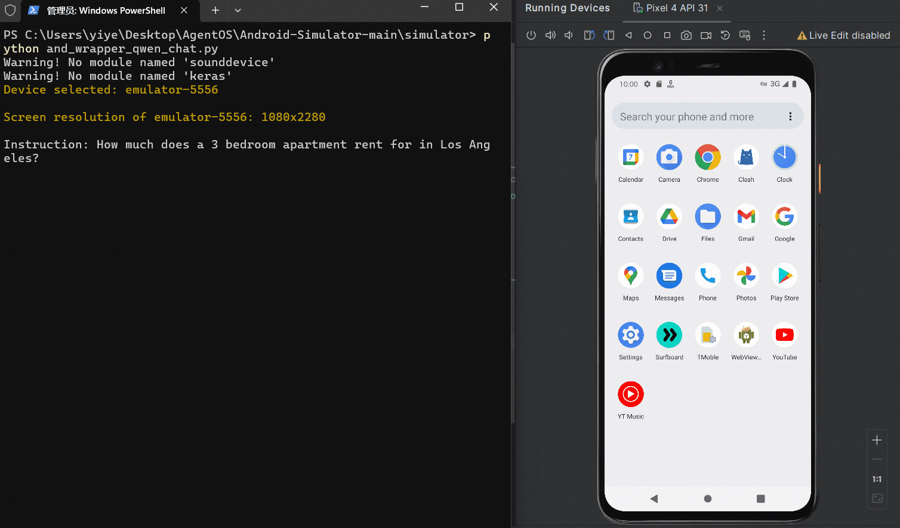

# GUICourse: From General Vision Langauge Models to Versatile GUI Agents 

Datasets, codes, and models for the paper "[GUICourse: From General Vision Langauge Models to Versatile GUI Agents]()".

Release process:
- [ ] Datasets
  - [ ] GUIEnv
    - [ ] GUIEnv-global (pre-training data)
    - [x] GUIEnv-local (SFT data)
  - [x] GUIAct
    - [x] GUIAct (web-single)
    - [x] GUIAct (web-multi)
    - [x] GUIAct (smartphone)
  - [x] GUIChat
- [x] Code
  - [x] Inference
  - [x] Evaluation
- [ ] Models

Updates:
- 2024/6/7: Release the datasets for SFT and evaluation.


## Data Summary

GUICourse is a group of complete datasets to train visual-based GUI agents from general VLMs, through improving VLMs' fundamental abilities and GUI knowledge. GUICourse is composed of three datasets: 

(1) GUIEnv, a large-scale dataset for improving VLMs' OCR and grounding abilities, including 10M website page-annotation pairs as pre-training data and 0.7M region-text QA pairs as SFT data; 

(2) GUIAct, a GUI navigation dataset in website and android scenarios for enhancing VLMs' knowledge of GUI systems, including 67k single-step and 15k multi-step action instructions. 

(3) GUIChat, a conversational dataset for improving the interaction skills of GUI agents, including 44k single-turn QA pairs and 6k multi-turn dialogues with text-rich images and bounding boxes.

## Demo





## Data Examples

### GUIEnv-global

### GUIEnv-local

### GUIAct-web-single

### GUIAct-web-multi

### GUIAct-smartphone

### GUIChat


## Dataset Access

### Download

The training set and testing set of GUIEnv-local is hosted on [Huggingface](https://huggingface.co/datasets/yiye2023/GUIEnv)

The training set and testing set of GUIAct is hosted on [Huggingface](https://huggingface.co/datasets/yiye2023/GUIAct)

The training set of GUIChat is hosted on [Huggingface](https://huggingface.co/datasets/yiye2023/GUIChat)

### Read
*Data Format*
```
              elements
uid_episode_10270193012375700035_step_00  /9j/4AAQSkZJRgABAQAAAQABAAD/2wBDAAgGBgcGBQgHBw...  [{'id': 0, 'position': {'height': 39, 'width':...
uid_episode_10270193012375700035_step_01  /9j/4AAQSkZJRgABAQAAAQABAAD/2wBDAAgGBgcGBQgHBw...  [{'id': 0, 'position': {'height': 42, 'width':...
uid_episode_10270193012375700035_step_02  /9j/4AAQSkZJRgABAQAAAQABAAD/2wBDAAgGBgcGBQgHBw...  [{'id': 0, 'position': {'height': 44, 'width':...
uid_episode_10270193012375700035_step_03  /9j/4AAQSkZJRgABAQAAAQABAAD/2wBDAAgGBgcGBQgHBw...  [{'id': 0, 'position': {'height': 32, 'width':...
uid_episode_10270193012375700035_step_04  /9j/4AAQSkZJRgABAQAAAQABAAD/2wBDAAgGBgcGBQgHBw...  [{'id': 0, 'position': {'height': 45, 'width':...
...                                                                                     ...
                   ...
uid_episode_12220552989760792145_step_01  /9j/4AAQSkZJRgABAQAAAQABAAD/2wBDAAgGBgcGBQgHBw...  [{'id': 0, 'position': {'height': 46, 'width':...
uid_episode_12220552989760792145_step_02  /9j/4AAQSkZJRgABAQAAAQABAAD/2wBDAAgGBgcGBQgHBw...  [{'id': 0, 'position': {'height': 56, 'width':...
uid_episode_12220552989760792145_step_03  /9j/4AAQSkZJRgABAQAAAQABAAD/2wBDAAgGBgcGBQgHBw...  [{'id': 0, 'position': {'height': 56, 'width':...
uid_episode_12220552989760792145_step_04  /9j/4AAQSkZJRgABAQAAAQABAAD/2wBDAAgGBgcGBQgHBw...  [{'id': 0, 'position': {'height': 54, 'width':...
uid_episode_12220552989760792145_step_05  /9j/4AAQSkZJRgABAQAAAQABAAD/2wBDAAgGBgcGBQgHBw...  [{'id': 0, 'position': {'height': 48, 'width':...
```
You can read our  data by:
```
import json
import pandas as pd
from io import BytesIO
import base64
from PIL import Image

def read_json(path):
    with open(path, 'r', encoding='utf8') as f:
        data = json.loads(f.read())
    return data

def read_parquet(path):
    return pd.read_parquet(path, columns=None)

def decode_base64_to_image(base64_string):
    return Image.open(BytesIO(base64.b64decode(base64_string))).convert("RGB")

def read_image_from_qarquet(cur_df, image_id):
    cur_image_str = cur_df.loc[image_id]["base64"]
    return decode_base64_to_image(cur_image_str)

instructions = read_json("xxx.json")
cur_df = read_parquet("xxx.parquet")

for ins in instructions:
    image_id =ins["image_id"]
    image = read_image_from_qarquet(cur_df, image_id)
    break

```
Notably, you should select a suitable version of `pyarrow` (e.g., pyarrow==13.0.0) for reading large parquet files.

### Visualization

You can visualize our data by:
"""
"""

## Evaluation

**ORC and Grounding Tasks**: 

```
cd ./evaluation

python eval_ocr_grounding.py \
  --pred_data=""
  --test_data="" \
  --img_data="" \
  --output_path="" \
  --log_error_samples=True \
  --visualize_error_samples=True
```

- `pred_data`: the path of your prediction file.
- `test_data`: the path of test_data_file.
- `img_data`: the path of used images.
- `output_path`: the path to output testing results
- `log_error_samples`: setting "True" for get error logs.
- `visualize_error_samples`: visualize the error samples

**GUI Navigation Tasks**: 
```
cd ./evaluation

python eval_task_act.py \
  --pred_data=""
  --test_data="" \
  --img_data="" \
  --output_path="" \
  --log_error_samples=True \
  --visualize_error_samples=True
```

## Contact

[Wentong Chen](mailto:cwt_0139@ruc.edu.cn), Renmin University of China

[Junbo Cui](mailto:cuijb2000@gmail.com), [Jinyi Hu](mailto:hu-jy21@mails.tsinghua.edu.cn), Tsinghua University


## Licensing Information

<a rel="license" href="http://creativecommons.org/licenses/by/4.0/"></a><br />The datasets are licensed under a <a rel="license" href="http://creativecommons.org/licenses/by/4.0/">Creative Commons Attribution 4.0 International License</a>.

Code under this repo is licensed under a MIT License.

## Disclaimer

These datasets were collected and released solely for research purposes, with the goal of training versatile GUI agents. The authors are strongly against any potential harmful use of the data or technology to any party. 

## Citation Information

If you find this dataset useful, please consider citing our paper:

```
@misc{,
  title={},
  author={},
  year={},
  eprint={},
  archivePrefix={},
  primaryClass={}
}
```
