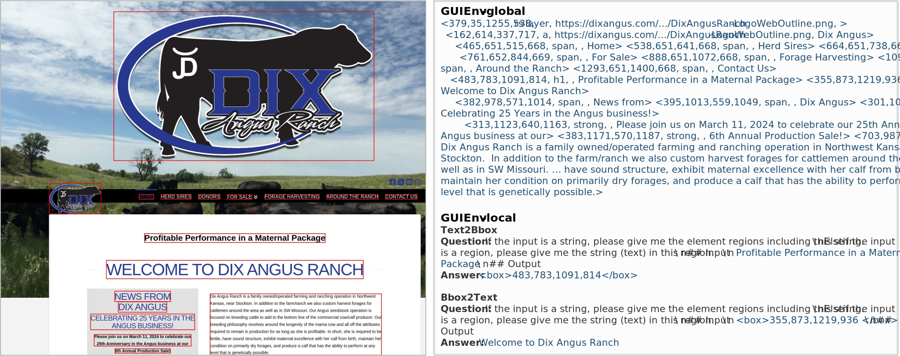
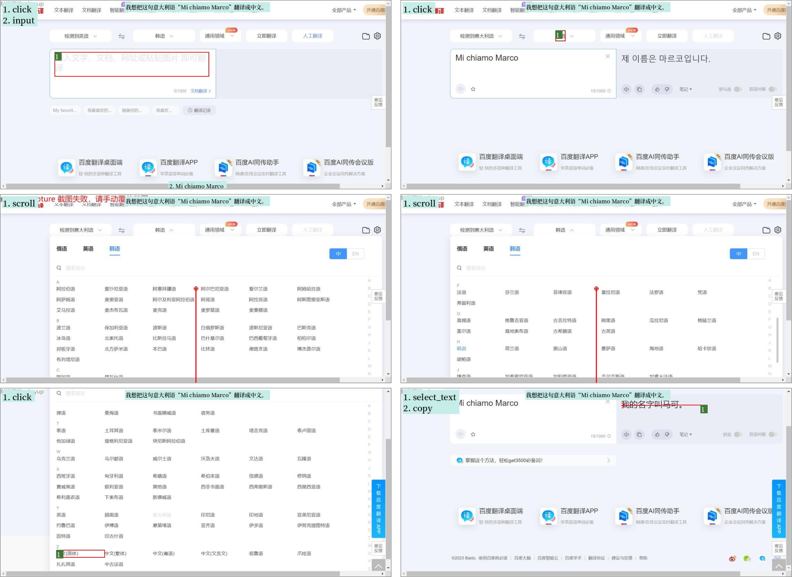
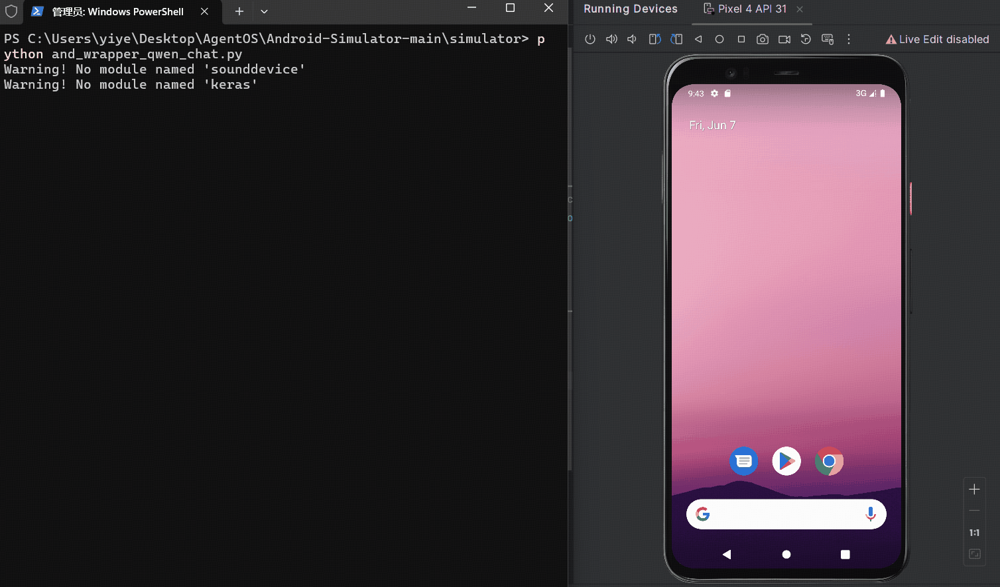
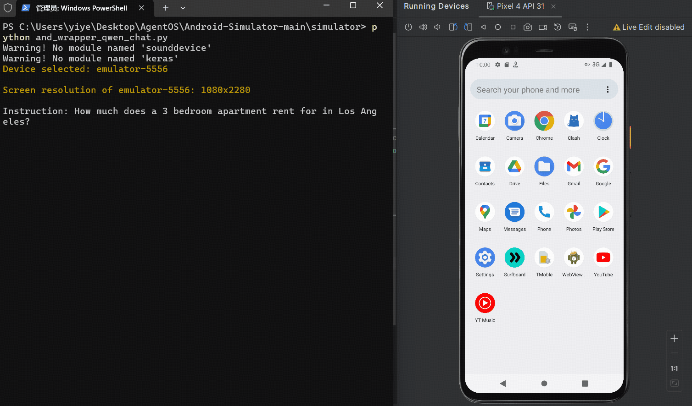

# 📱🖥️ GUICourse: From General Vision Langauge Models to Versatile GUI Agents 

Datasets, codes, and models for the paper "[GUICourse: From General Vision Langauge Models to Versatile GUI Agents](https://arxiv.org/abs/2406.11317)".

Release process:
- [ ] Datasets
  - [ ] GUIEnv
    - [ ] GUIEnv-global (pre-training data)
    - [x] GUIEnv-local (SFT data)
  - [x] GUIAct
    - [x] GUIAct (web-single)
    - [x] GUIAct (web-multi)
    - [x] GUIAct (smartphone)
  - [x] GUIChat
- [ ] Code
  - [x] Data Preprocess
  - [ ] Inference
  - [x] Evaluation
- [ ] Models

Updates:
- 2024/6/7: Release the datasets, loading code, and evaluation code.


## Data Summary

GUICourse is a group of complete datasets to train visual-based GUI agents from general VLMs, through improving VLMs' fundamental abilities and GUI knowledge. GUICourse is composed of three datasets: 

(1) GUIEnv, a large-scale dataset for improving VLMs' OCR and grounding abilities, including 10M website page-annotation pairs as pre-training data and 0.7M region-text QA pairs as SFT data; 


(2) GUIAct, a GUI navigation dataset in website and Android scenarios for enhancing VLMs' knowledge of GUI systems, including 67k single-step and 15k multi-step action instructions. 


(3) GUIChat, a conversational dataset for improving the interaction skills of GUI agents, including 44k single-turn QA pairs and 6k multi-turn dialogues with text-rich images and bounding boxes.


## Dataset Access

### Download
The data of [GUIEnv-local](https://huggingface.co/datasets/yiye2023/GUIEnv), [GUIAct](https://huggingface.co/datasets/yiye2023/GUIAct), and [GUIChat](https://huggingface.co/datasets/yiye2023/GUIChat) are hosted on Huggingface.

### Read
*Data Format.* 
We use `JSON` and `parquet` format to save our datasets.
```
              elements
uid_episode_10270193012375700035_step_00  /9j/4AAQSkZJRgABAQAAAQABAAD/2wBDAAgGBgcGBQgHBw...  [{'id': 0, 'position': {'height': 39, 'width':...
uid_episode_10270193012375700035_step_01  /9j/4AAQSkZJRgABAQAAAQABAAD/2wBDAAgGBgcGBQgHBw...  [{'id': 0, 'position': {'height': 42, 'width':...
uid_episode_10270193012375700035_step_02  /9j/4AAQSkZJRgABAQAAAQABAAD/2wBDAAgGBgcGBQgHBw...  [{'id': 0, 'position': {'height': 44, 'width':...
...                                                                                     ...
                   ...
uid_episode_12220552989760792145_step_01  /9j/4AAQSkZJRgABAQAAAQABAAD/2wBDAAgGBgcGBQgHBw...  [{'id': 0, 'position': {'height': 46, 'width':...
uid_episode_12220552989760792145_step_02  /9j/4AAQSkZJRgABAQAAAQABAAD/2wBDAAgGBgcGBQgHBw...  [{'id': 0, 'position': {'height': 56, 'width':...
```
You can read our  data by:
```
python data_load.py \
  --data_path "./data/xxx_data.json"
  --img_path "./data/xxx_images.parquet"
  --dataset "guixxx"

```
- `data_path`: the path of your JSON data, such as `ocr_grounding_test_data.json`.
- `img_path`:  the path of used images, such as `ocr_grounding_test_images.parquet`. Notably, you should select a suitable version of `pyarrow` (e.g., pyarrow==13.0.0) for reading large parquet files.
- `dataset`: the name of the dataset, such as `guienv`.

*Visualization.*
You can visualize our data using the functions `actions_visual` and `elements_visual`.

### Preprocess
```
cd data_preprocess
```
You can convert our data to the common format of SFT data in three steps: 

*Step 1.* Reading images from 'parquet' files, convert them to 'png' format.
Download our data with the suffix `parquet`, and put them in a dir `data`. 
```
python convert_parquet_to_png.py
```

*Step 2.* Convert 'json' files to QA-pairs.
```
python convert_to_sft_instructions.py
```

*Step 3.* Merge different data.
You should change the code depending on your models' input formats and the data you want to use. We use the `Qwen-VL`'s format as an example.
```
python merge_data.py
```

## Evaluation

```
cd ./evaluation

python evaluation.py \
  --file_name="your_test_file_name" \
  --task="xxx" \
```
- `file_name`: the name of your prediction file (without the suffix `.json`).
- `task`: the name of tasks, including `guienv`, `guiact_web_single`, `guiact_web_multi`, and `guiact_smartphone`.

*Examples.* 
We provide some results for quick evaluation in the `./results` dir.

## Performance

### Cases
There are some visual cases of our GUI agents.  





### Demo: GUIAgent in Andriod Simulated Environment
To evaluate the robustness of our GUI agents, we use a simulated smartphone environment by Android Studio to do interactive testing.




## Contact

[Wentong Chen](mailto:cwt_0139@ruc.edu.cn), Renmin University of China

[Junbo Cui](mailto:cuijb2000@gmail.com), [Jinyi Hu](mailto:hu-jy21@mails.tsinghua.edu.cn), Tsinghua University


## Licensing Information

<a rel="license" href="http://creativecommons.org/licenses/by/4.0/"></a><br />The datasets are licensed under a <a rel="license" href="http://creativecommons.org/licenses/by/4.0/">Creative Commons Attribution 4.0 International License</a>.

The code under this repo is licensed under an MIT License.

## Disclaimer

These datasets were collected and released solely for research purposes, with the goal of training versatile GUI agents. The authors are strongly against any potentially harmful use of the data or technology by any party. 

## Citation Information

If you find this dataset useful, please consider citing our paper:

```
@misc{,
  title={GUICourse: From General Vision Language Models to Versatile GUI Agents},
  author={Wentong Chen and Junbo Cui and Jinyi Hu and Yujia Qin and Junjie Fang and Yue Zhao and Chongyi Wang and Jun Liu and Guirong Chen and Yupeng Huo and Yuan Yao and Yankai Lin and Zhiyuan Liu and Maosong Sun},
  year={2024},
  journal={arXiv preprint arXiv:2406.11317},
}
```
